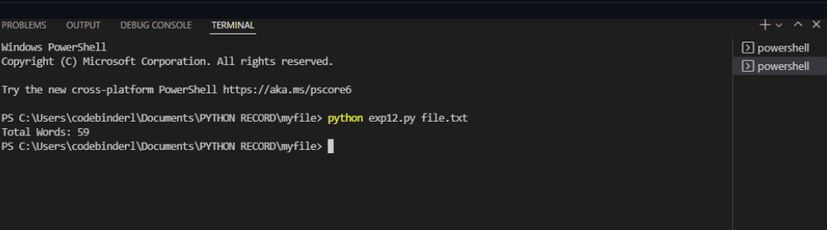

# command-line-arguments-to-count-word
## AIM:
To write a python program for getting the word count from the contents of a file using command line arguments.
## EQUIPEMENT'S REQUIRED: 
PC
Anaconda - Python 3.7
## ALGORITHM: 
### Step 1:
 Import pandas.
### Step 2: 
 Import linear_modal from sklearn.
### Step 3: 
 Read the file using read_csv.
### Step 4:  
 Get the inputs from the user as x and y.
### Step 5: 
Use regr.fit(x,y) to et the output.

## PROGRAM:
```
#Program to command line arguments to count word.
#Developed by: Barath Kumar J
#Register number: 212221230012
import sys
fp =open(sys.argv[1])
data=fp.read()
words=data.split()
print("Total Number of Words : ",len(words))
```

### OUTPUT:



## RESULT:
Thus the program is written to find the word count from the contents of a file using command line arguments.
